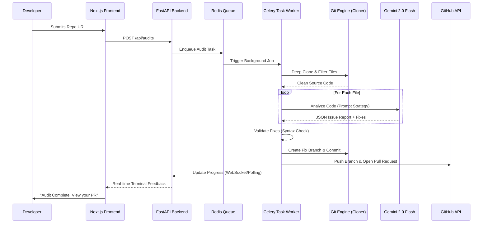

# 🤖 DevSynapse: The Autonomous Software Engineering Ecosystem
[](LICENSE)
[](https://deepmind.google/technologies/gemini/)
[](https://www.docker.com/)
[](https://autodev-frontend.onrender.com/)

> **DevSynapse** is an industry-leading autonomous software engineering workforce. It bridges the gap between project planning, architectural understanding, and automated code maintenance using high-reasoning AI agents.

---

## 🔗 Live Deployment
**Explore the live dashboard here:** [https://autodev-frontend.onrender.com/](https://autodev-frontend.onrender.com/)

---

## 🚩 Problem Statement: The Reality of Modern Dev
**Every developer loses hours to the "Context Tax":**

*   **Understanding unfamiliar GitHub repositories:** Spending days deciphering file structures instead of coding.
*   **Planning work against tight deadlines:** Losing sleep over project decomposition and resource hunting.
*   **Fixing bugs that reappear:** Spending 60% of time on maintenance because no one fully understands dependency impacts.

**Existing tools show code — they do not show *understanding*.** DevSynapse was built to provide that missing cognitive layer.

---

## 🌟 The DevSynapse Ecosystem
DevSynapse is not just a tool; it is a **triad of autonomous agents** designed to handle the entire software lifecycle:

1.  **[Strategic Planner (AAPP)](https://spectacular-gumdrop-c2c3c7.netlify.app/)**: 
    *   *The Project Manager:* Takes high-level assignment descriptions and decomposes them into day-by-day atomic tasks. 
    *   *Curated Learning:* Automatically finds the best videos, docs, and repos for every step.

2.  **[VibeCraft Navigator](https://repo-dig.vercel.app/)**: 
    *   *The Architect:* Visualizes your codebase as a 3D, physics-based knowledge graph. 
    *   *Deep Understanding:* Uses Neo4j and Tree-sitter to reveal the "shape" of your code, making complex dependencies visible at a glance.

3.  **Autonomous Auditor (This Repo)**: 
    *   *The Workhorse:* Proactively audits your repository for bugs and security flaws. 
    *   *Self-Healing:* Don't just find bugs—it creates the fix, validates it, and opens a Pull Request autonomously.

---

## 🏗️ In-Depth Architecture

### System Workflow Diagram
DevSynapse uses a modern, asynchronous event-driven architecture to handle high-compute AI tasks without blocking the user interface.



### Detailed Component Roles
*   **API Gateway (FastAPI)**: Manages authentication, audit history, and real-time log orchestration.
*   **Task Broker (Redis)**: Ensures reliable message passing between the API and the background workers.
*   **Execution Worker (Celery)**: The heavy-lifter. Manages local file systems, Git operations, and AI interaction.
*   **Knowledge Base (PostgreSQL)**: Stores audit results, detected issues, and PR metadata for long-term tracking.

---

## 🛠️ Complete Tech Stack

### 💻 Frontend (The Command Center)
*   **Next.js 14**: Utilizing App Router for high-performance server-side rendering.
*   **TailwindCSS**: Custom glassmorphism design system for a premium developer feel.
*   **Lucide React**: Vector-perfect iconography for clear visual hierarchy.
*   **Axios**: Robust API communication with interceptors for error management.

### ⚙️ Backend (The Engine)
*   **FastAPI**: High-performance Python framework with built-in Pydantic validation.
*   **SQLAlchemy**: Advanced ORM for complex repository and issue relations.
*   **Celery**: Distributed task queue for non-blocking analysis.
*   **GitPython**: Low-level Git control for branch management and cloning.

### 🧠 AI & Intelligence
*   **Google Gemini 2.0 Flash**: Our primary reasoning engine. Selected for its massive context window and lightning-fast code generation.
*   **Proprietary Prompt Templates**: Optimized for "No-Hallucination" JSON outputs.

### 🗄️ Infrastructure & Storage
*   **PostgreSQL**: Relational storage for auditing history and statistics.
*   **Redis**: In-memory caching and task brokering.
*   **Docker & Docker Compose**: Complete containerization for "Write Once, Run Anywhere" reliability.

---

## 🧠 AI Tools & Prompt Strategy

DevSynapse doesn't just "talk" to AI; it orchestrates it through a multi-step **Prompt Strategy**:

### 1. File Discovery & RAG-Lite
The worker first "sees" the repo and filters out junk (node_modules, .git, .env) to sharpen the AI's focus on actual business logic.

### 2. Multi-Stage Chain of Thought (CoT)
Our system prompts enforce a 3-step reasoning process:
1.  **Identify**: Pinpoint the line and type of bug (Security, Logic, or Performance).
2.  **Explain**: Contextualize *why* it's a problem for the developer.
3.  **Repair**: Generate a syntactically correct fix that maintains the original code style.

### 3. Structural Output Enforcement
We use **JSON Schema Mode** to ensure the AI never returns free-form text that would break the automated PR engine. Every response is a valid JSON object that the worker can parse and apply.

### 4. Advanced Orchestration & Reasoning
DevSynapse's true power lies in its multi-layered prompt architecture. We don't just send code to an LLM; we wrap it in a sophisticated execution environment.

#### A. The Semantic Filtering Layer (RAG-Lite)
Before any AI processing happens, the worker performs a lexicographical scan of the repository. 
*   **Relevance Scoring**: Files are scored based on their extension and position in the directory tree.
*   **Dependency Pruning**: Using `ignore` patterns similar to `.gitignore`, we ensure that binary blobs, build artifacts, and vendor files never consume AI context window tokens.

#### B. The Structured Thinking Protocol (STP)
Every analysis request follows a strict **Structured Thinking Protocol**:
1.  **Context Injection**: The AI is provided with a "Developer Identity" (Senior Security Engineer) and a specific mission objective.
2.  **Constraint Satisfaction**: The prompt includes negative constraints (e.g., "Do NOT use deprecated libraries," "Do NOT change functionality").
3.  **Cross-File Correlation**: When analyzing a specific file, the agent is often provided with "Context Snippets" from related headers or configuration files to understand local coding standards.

#### C. Validation & Self-Correction
Once the AI generates a fix, it undergoes a **Post-Generation Validation**:
*   **Syntactic Checker**: The worker attempts to parse the suggested code snippet. If it fails, the agent is re-queried with the specific error message to "self-correct" the fix.
*   **Style Matching**: The agent reviews the original file's indentation (tabs vs spaces) and naming conventions to ensure the fix looks like it was written by the original author.

---

## 🎯 Prompt Engineering Strategy: The Deep Dive

### 1. Zero-Shot Code Intelligence
We leverage **Gemini 2.0 Flash's** inherent deep-learning weights for zero-shot bug detection. By providing a high-authority system prompt, we force the model to look past superficial syntax and analyze logic flow.
*   **Variable Tainting**: The agent is prompted to track user-controlled input (from APIs or Forms) through the code to detect "Taint-Sink" vulnerabilities like SQL Injection.
*   **Concurrency Analysis**: Special prompts are used for files containing `async`, `await`, or `threading` to look specifically for race conditions.

### 2. High-Fidelity JSON Schema Enforcement
To ensure seamless integration with our automated PR engine, we use a "Schema-First" prompt strategy. 
*   **Strict Output Mode**: The AI is instructed that any non-JSON content in its output is a critical failure.
*   **Payload Structure**:
    ```json
    {
      "analysis": {
        "summary": "Brief overview of file health",
        "health_score": 1-100
      },
      "issues": [
        {
          "type": "logic_error",
          "severity": "high",
          "location": "L42-L48",
          "fix_code": "...",
          "rationale": "Why this specific fix was chosen"
        }
      ]
    }
    ```

### 3. Contextual RAG & Sliding Windows
For large files that exceed the high-density reasoning window, DevSynapse employs a **Sliding Context Window**:
*   **Overlap Analysis**: Files are broken into chunks with a 20% overlap, ensuring that issues defined at chunk boundaries (like a function starting in one chunk and ending in another) are never missed.
*   **Global Summary Injection**: A high-level summary of the entire file is injected into every chunk's prompt to maintain "Global Vision."

### 4. Behavioral "Identity" Prompting
We use different "Personas" for different stages of the audit:
*   **The Auditor Persona**: Focused on finding flaws, being cynical of input, and suspecting security gaps.
*   **The Architect Persona**: Focused on code smells, design patterns, and efficiency.
*   **The Refactor Persona**: Focused on generating the cleanest, most idiomatic fix possible.

### 5. Multi-Agent Feedback Loop
In complex scenarios, the results from the **Auditor** are fed into the **Architect** for a second opinion. This "Debate Mode" significantly reduces False Positives and ensures that only valid, high-impact issues are reported to the developer.

---

## 🏁 Setup & Installation Guide

### Prerequisites
*   [Docker Desktop](https://www.docker.com/products/docker-desktop/) (Essential)
*   [Google Gemini API Key](https://aistudio.google.com/app/apikey)
*   [GitHub Personal Access Token](https://github.com/settings/tokens) (Check the **`repo`** scope)
*   **Environment Setup**:
       create a file named `.env` in the root folder. Paste your keys:
       ```env
       GEMINI_API_KEY=your_key_here
       GITHUB_TOKEN=your_token_here
       DATABASE_URL=postgresql://autodev:password@db:5432/autodev_db
       REDIS_URL=redis://redis:6379/0
       NEXT_PUBLIC_API_URL=http://localhost:8000
       ```
---

### 🪟 Windows Setup Instruction
1.  **Clone the Repo**:
    ```cmd
    git clone https://github.com/Robert2101/AutoDev-Agent.git
    cd AutoDev-Agent
    ```

2.  **Launch**:
   Open **Command Prompt** or **PowerShell** in the project root directory and run:
   ```bash
   start.bat

   ```

### 🍎 Mac / 🐧 Linux Setup Instruction
1.  **Clone & Enter**:
    ```bash
    git clone https://github.com/Robert2101/AutoDev-Agent.git
    cd AutoDev-Agent
    ```
2.  **Configure Environment**:
    ```bash
    cp .env.example .env # Or create manually
    nano .env
    ```
3.  **Permissions & Run**:
    ```bash
    chmod +x start.sh
    ./start.sh
    ```
4.  **Verification**: 
    Open your browser to `http://localhost:3000`. If you see the "DevSynapse" dashboard, you are live.

---

## ⚡ Deployment on Cloud (Render.com)

DevSynapse is fully optimized for **Render's Free Tier**:
*   **Backend**: Deploys as a Docker Web Service.
*   **Workers**: Included in the same Docker image to save costs.
*   **Database**: Automatic SSL configuration for Render Managed PostgreSQL.
*   **Redis**: seamless integration with Upstash (Auto-SSL fix included).

For a step-by-step guide, see our **[DEPLOYMENT.md](./DEPLOYMENT.md)**.

---

## 🚀 Key Features in Detail

### 🔍 Deep Code Auditing
Scans your entire repository using **Gemini 2.0 Flash** to identify:
*   **Security Vulnerabilities**: SQL injection, XSS, exposed secrets (API keys).
*   **Logical Bugs**: Race conditions, edge-case failures, and syntax errors.
*   **Code Smells**: Refactoring opportunities and performance bottlenecks.

### 🛠️ Automated Self-Healing
*   **PR Generation**: Automatically creates a new branch and opens a Pull Request with the fix.
*   **Syntax Validation**: The agent validates its own fixes before submitting to ensure they are runnable.
*   **AI Chain-of-Thought**: Uses structured prompting to "reason" through a fix before applying it.

### 📊 Real-Time Developer Experience
*   **Live Terminal Logs**: See exactly what the AI is thinking, cloning, and fixing in a real-time terminal UI.
*   **Smart Branch Detection**: Automatically identifies your default default branch (main/master) to ensure zero-config setups.
*   **Fast-Fail Quota Management**: Detects AI quota limits and terminates tasks gracefully to free up the execution queue.

---

## 🤝 Contributing & Community
We believe in the power of open-source AI. 
*   **Bug Reports**: Open an issue on GitHub.
*   **Pull Requests**: We welcome UI improvements and new AI analysis protocols.
*   **Feature Ideas**: Join our discussions to help shape the future of DevSynapse.

---

## 📝 License & Attribution
Distributed under the **MIT License**. See `LICENSE` for more information.

---
**[DevSynapse]** - Transforming the shape of software engineering. 
*Built by the DevEdge Team for the Hackathon 2026.*
